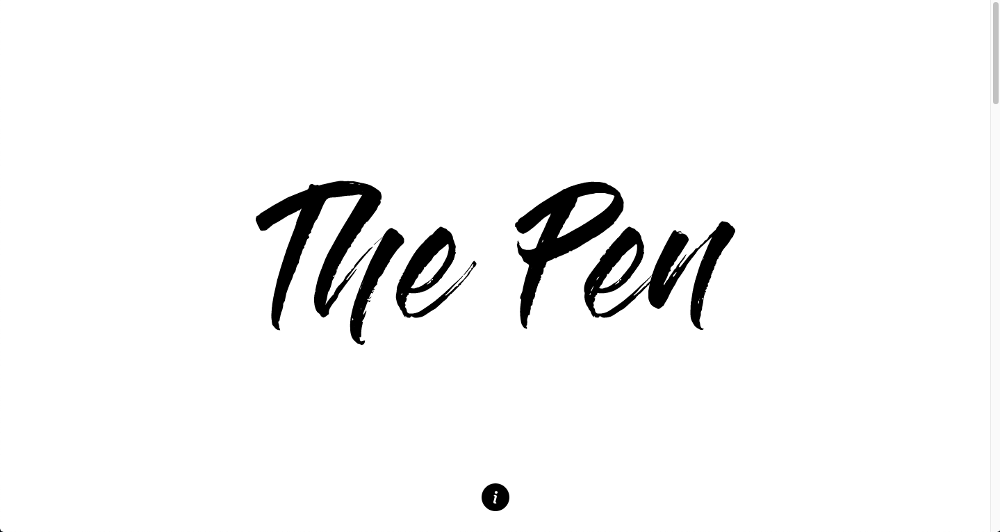
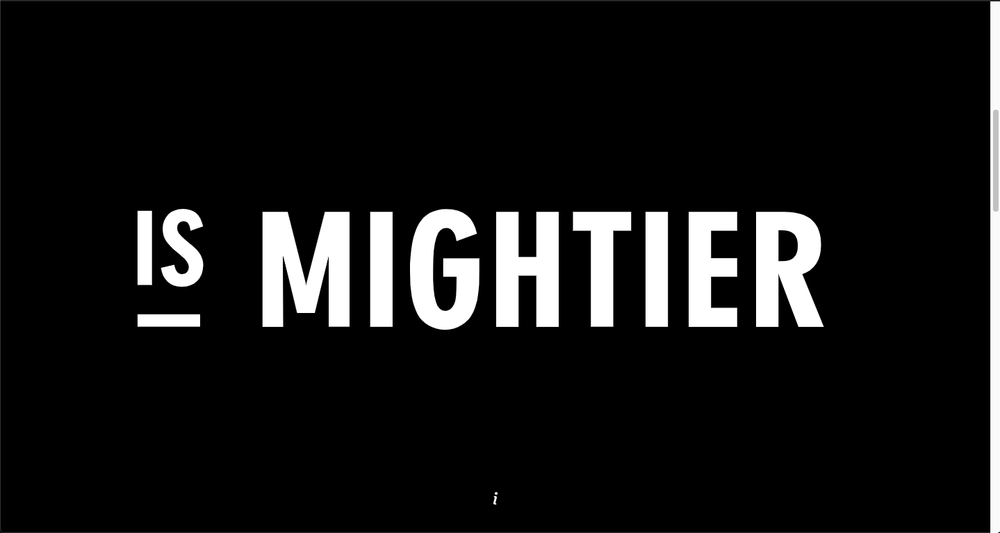
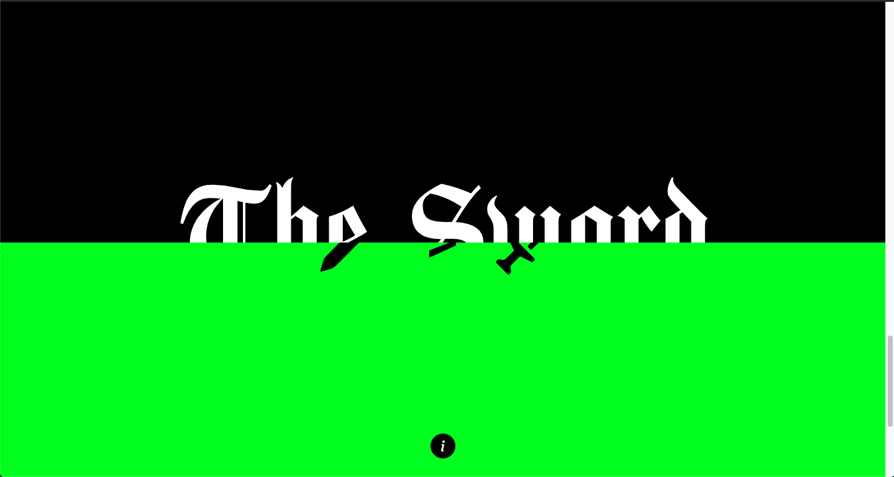

# The Pen is Mightier than the Sword
> Here goes your awesome project description!

## Table of contents
* [General info](#general-info)
* [Screenshots](#screenshots)
* [Technologies](#technologies)
* [Demo](#demo)
* [Features](#features)
* [Status](#status)
* [Inspiration](#inspiration)
* [Contact](#contact)

## General info
This was the first homework project on the [Superhi Foundation](https://superhi.com/courses/html-css-javascript-foundation) course. The project is based on the main project of the week, [Sally Hart Portfolio](https://github.com/guybroadhurst/sally-hart-portfolio), but redesigned by Luke Willetts around the famous quote "The pen is mightier than the sword".

## Screenshots

## Technologies
* HTML
* CSS3

## Demo
[Live Demo](https://guybroadhurst.github.io/the-pen/)

## Features
List of features:
* As you scroll the photographs reveal themselves with a shutter/parallax effect.
* On mobile sized screens, this effect is disabled.

## Status
Project is: _finished_ and complete for the course

## Inspiration
Designed by Luke Willetts. [Website](http://www.lukewilletts.com/) [Twitter](https://twitter.com/lukewilletts)
 
## Contact
Created by [@guybroadhurst](https://www.guybroadhurst.co.uk/) - feel free to contact me!